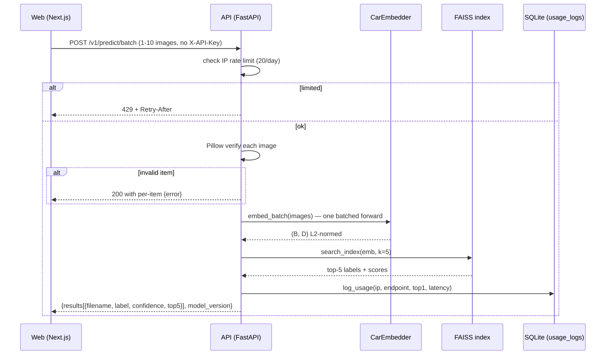
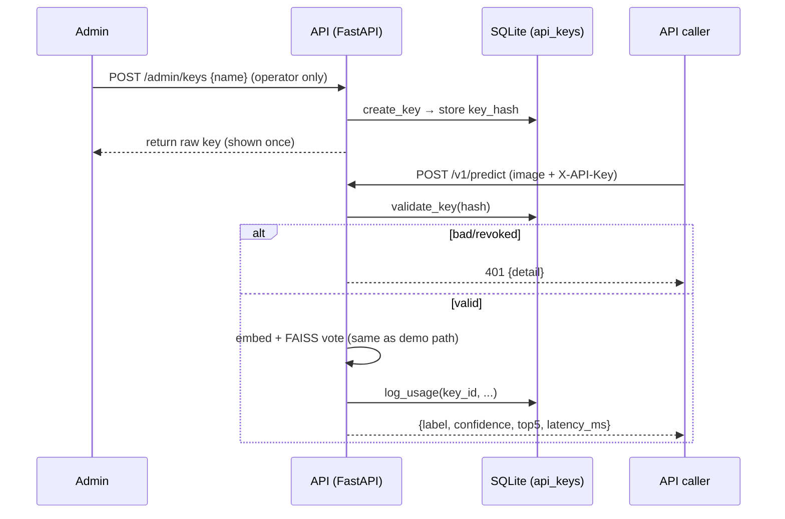
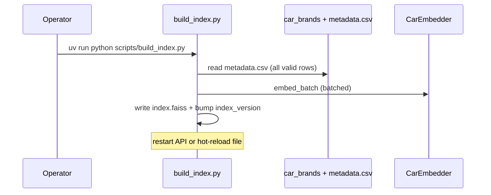

# Car Classifier — Sequence Diagrams (v1)

## 1. Demo batch upload (no key, IP rate-limited)

```mermaid
sequenceDiagram
    participant U as Web (Next.js)
    participant A as API (FastAPI)
    participant M as CarEmbedder
    participant F as FAISS index
    participant D as SQLite (usage_logs)
    U->>A: POST /v1/predict/batch (1-10 images, no X-API-Key)
    A->>A: check IP rate limit (20/day)
    alt limited
        A-->>U: 429 + Retry-After
    else ok
        A->>A: Pillow verify each image
        alt invalid item
            A-->>U: 200 with per-item {error}
        end
        A->>M: embed_batch(images) — one batched forward
        M-->>A: (B, D) L2-normed
        A->>F: search_index(emb, k=5)
        F-->>A: top-5 labels + scores
        A->>D: log_usage(ip, endpoint, top1, latency)
        A-->>U: {results[{filename, label, confidence, top5}], model_version}
    end
```

## 2. Authenticated API call + admin key issuance

```mermaid
sequenceDiagram
    participant Ad as Admin
    participant A as API (FastAPI)
    participant DB as SQLite (api_keys)
    participant C as API caller
    Ad->>A: POST /admin/keys {name} (operator only)
    A->>DB: create_key → store key_hash
    A-->>Ad: return raw key (shown once)
    C->>A: POST /v1/predict (image + X-API-Key)
    A->>DB: validate_key(hash)
    alt bad/revoked
        A-->>C: 401 {detail}
    else valid
        A->>A: embed + FAISS vote (same as demo path)
        A->>DB: log_usage(key_id, ...)
        A-->>C: {label, confidence, top5, latency_ms}
    end
```

## 3. Offline index rebuild (no runtime writes)

```mermaid
sequenceDiagram
    participant Op as Operator
    participant S as build_index.py
    participant FS as car_brands + metadata.csv
    participant M as CarEmbedder
    Op->>S: uv run python scripts/build_index.py
    S->>FS: read metadata.csv (all valid rows)
    S->>M: embed_batch (batched)
    S->>S: write index.faiss + bump index_version
    Note over S: restart API or hot-reload file
```
